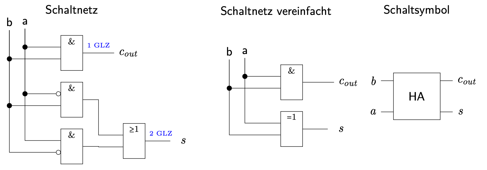
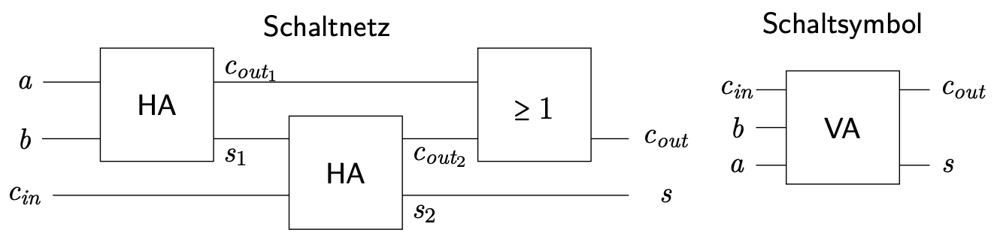
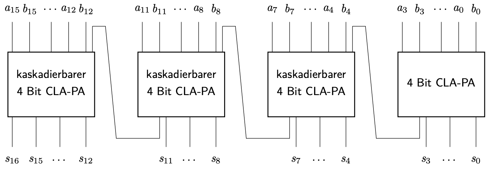
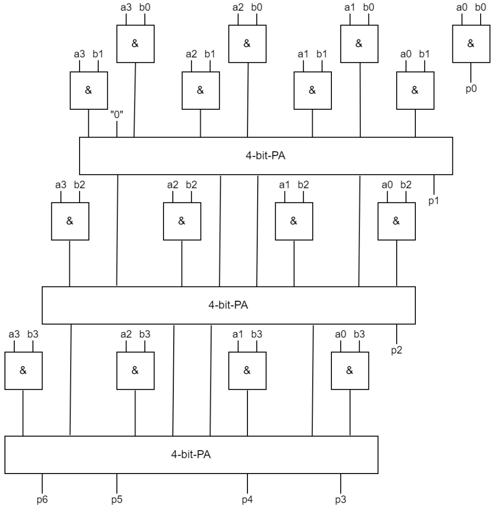
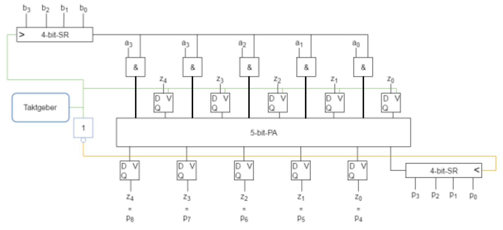
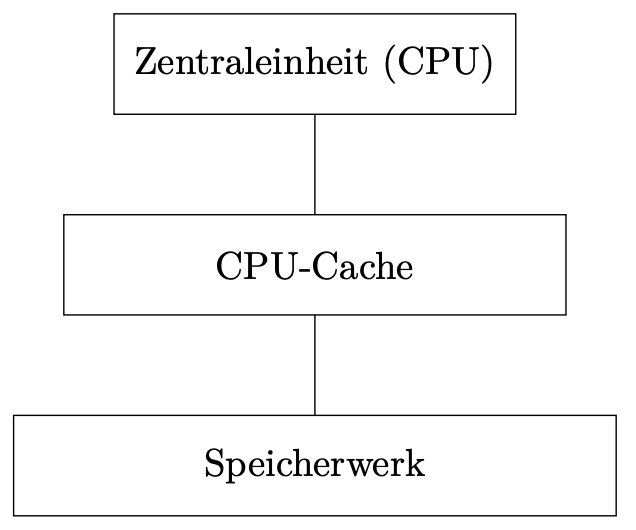
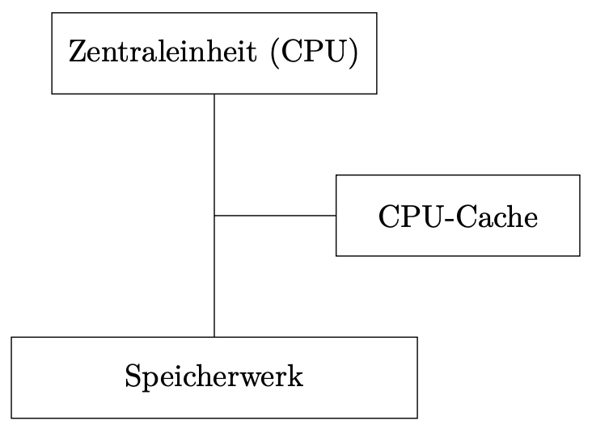
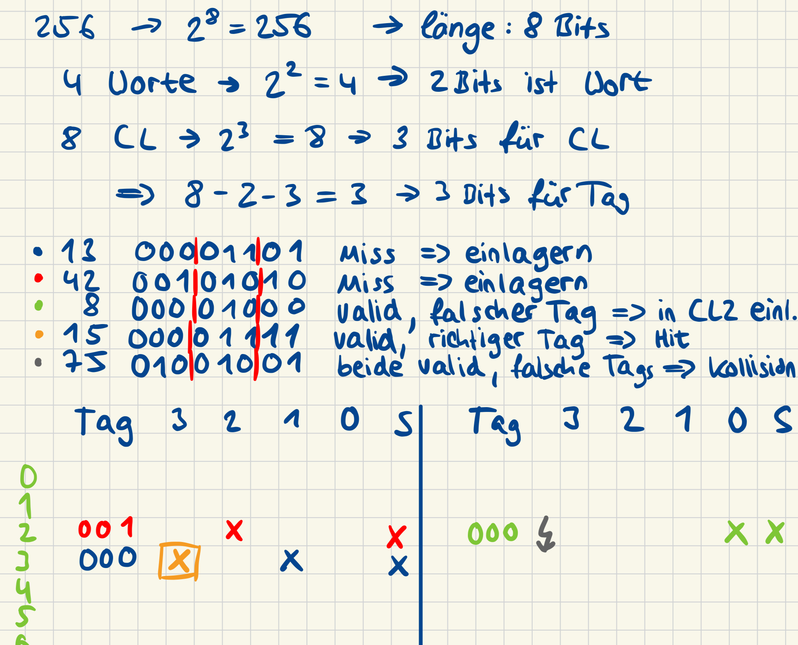
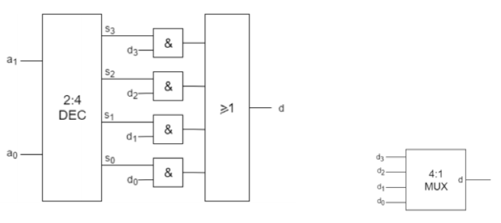
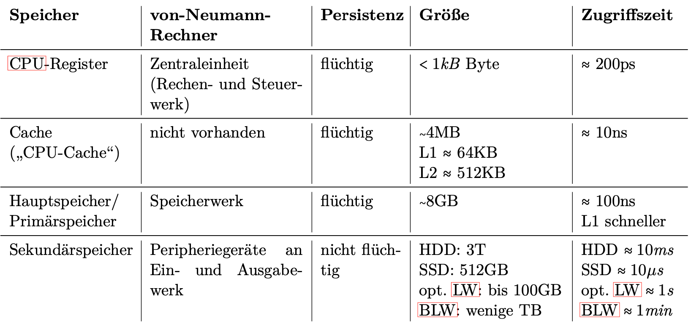

# Cheat Sheet Hottest

**Angugge**:

- [ ] Komparatoren
- [ ] Serielladdierer

## Addierer

### Halbaddierer

### Volladdierer

### 4-Bit-Ripple-Carry-Paralleladdierrer (RC-PA)

**Hardwareaufwand**: Steigt linear mit Breite der Summanden (gut, weil besseres (weniger Aufwand) ist kaum zu erwarten)

- **HA**: 2 Tr. für `c_out` + 6 Tr. für `s` = 8 Transistoren
- **VA**: 2 \* HA + 2 Tr. für `c_out` = 18 Transistoren
- **n-bit**: 1 HA + (n - 1) VA = 8 Tr. + (n - 1) \* 18 Tr.

**Zeitaufwand**:

- **HA**: max. 2 Gatterlaufzeiten (GLZs)
- **VA**: max. 4 GLZs
- `s_i` liegen nach unterschiedlicher Zeit an. `s_i` wird nach `(i + 2) * 2` GLZ erreicht. Das laengste `s_i` ist bein n-Bit-RC-PA `i = n - 1` => Zeitaufwand ist `2n` GLZ. Schlecht, zu erwarten waere O(1)! Beim Wechsel von `32-` auf `64-Bit`-CPI haette sich Taktfrequenz halbiert => kein 64-RC-PA in CPU verbaut.

### 4-Bit-Carry-Look-Ahead-Paralleladdierer (CLA-PA)

`c_in` wird nicht von vorausgehenden VA (oder HA) uebernommen, sondern durch "magisches CLA-Schaltnetz" nachberechnet.
Fuer Berechnung von `C_in_i` muessen alle vorherigen Eingaenge `a_j`, `b_j`, `j < i` beruecksichtigt wrden.
`c_in` wird im Vorraus berechnet -> besserer Zeitaufwand.

**Hardwareaufwand**:

- Falls alle Vollkunjunktionen verwendet werden müssen: `2^*(2i) * 2i` Transistoren = `2i * 4^i` = `O(n^2 * 4^n)`
- Hardwareaufwand steigt beim n-Bit-CLA-PA überexponentiell mit `n`.
  - Beim Wechsel von 32- auf 64-Bit System wäre 16 Trillionen-fache Aufwand an Transistoren nötig gewesen.
  - n = 4: 4^2 \* 2^4 = 256 Tr.
  - n = 8: 8^2 \* 2^8 = 16384 Tr.

**Zeitaufwand**:

- Es kann jeweils eine DNF, DMF oder jede andere DxF verwendet werden. Jeweils nur genau (max.) 2 GLZ.
- Jedes s_i genau 6 GLZ (ausser s_0: 2 GLZ, s_1: 5 GLZ)
- O(1)

> **Kombination**: 32-Bit Addierer wird in acht 4-Bit CLA-PAs gesplittet (hintereinander geschaltet nach RC-Prinzip). Damit ist das `n` der nicht-CLA-PA noch klein => erträglicher Hardwareaufwand.
> 

# Aufgabe 1 / Architekturen

---

> (2020, 2020n, 2021, 2022) Fur den Aufbau von Rechnern lassen sich zwei grundsaetzlich unterschiedliche Architekturen verwenden.
> Nennen und skizzieren Sie diese, erlaeutern Sie kurz die einzelnen Komponenten, und gehen Sie inbesondere auf den Unterschied der beiden Architekturen bezuglich
> Aufbau sowie ihre jeweiligen Vor- und Nachteile ein!

**Welche gibt es?**

- Von-Neumann-Architektur (Mehrzahl elektronischer Universalrechner)
- Harvard-Architektur

**Skizze, Komponente und Unterschiede**

- **Rechenwerk**: Durchführen von Rechnungen mit numerischen und logischen Werten
- **Steuerwerk**: Interpretation des Programmcodes und Koordination aller Werke
- **Speicherwerke**: Speichern von Informationen (sowohl Programmcode als auch Nutzdaten)
- **Eingabewerk**: "logische Schnittstelle" zu Eingabegerät z.B. USB-Controller
- **Ausgabewerk**: "logische Schnittstelle" für Ausgabegeräte z.B. Graka
- **Bus-System**: Verbindet alle Komponenten und ermöglicht Datenaustausch

**→ Unterschiede Aufbau**: Harvard-Architektur weißt klare Trennung von
Programmcode und Nutzdaten auf, was bei der von-Neumann-Architektur gleich
gehalten wird

**Vor- und Nachteile**

<table>
    <tr>
        <th></th>
        <th>Vorteile</th>
        <th>Nachteile</th>
    </tr>
    <tr>
        <th>Von-Neumann</th>
        <td>
            <ul>
                <li>universelle Programmierbarkeit</li>
                <li>flexible Speicheraufteilung zwischen Programmcode und Daten</li>
                <li>kostengünstig</li>
                <li>einfache Updates von Programm und Betriebssystem</li>
            </ul>
        </td>
        <td>
            <ul>
                <li>Virenanfälligkeit</li>
                <li>Nutzdaten können als Programmcode ausgeführt werden</li>
                <li>möglicher Flaschenhals Bus & Speicherwerk</li>
            </ul>
        </td>
    </tr>
    <tr>
        <th>Harvard</th>
        <td>
            <ul>
                <li>nahezu immun gegen unabsichtlichen Virenbefall</li>
                <li>keine (unabsichtlichen oder ungewollten) Änderungen an der Betriebssoftware möglich</li>
                <li>bessere Performance möglich durch gleichzeitigen Zugriff auf beide Speicherwerke</li>
            </ul>
        </td>
        <td>
            <ul>
                <li>komplexer und teurer durch mehr Hardware</li>
                <li>schwer update-fähig</li>
                <li>ohne zweites Eingabewerk gibt es keine Möglichkeit anderen Programmcode auszuführen</li>
                <li>unflexible Aufteilung des Speichers</li>
            </ul>
        </td>
    </tr>
</table>

> (2020, 2020n, 2021, 2022) Nennen Sie konkrete Anwendungsfaelle fur den Einsatz dieser beiden Architekturen bei heutigen "Rechnern"

<table>
    <tr>
        <th>von-Neumann</th>
        <th>Harvard</th>
    </tr>
    <tr>
        <td>
            <ul>
                <li>übliche PC-Architektur (universal PC)</li>
            </ul>
        </td>
        <td>
            <ul>
                <li>"embedded systems" (z.B. in Waschmaschinen, KFZ-Elektronik, etc.)</li>
                <li>Smartphones & Co.</li>
                <li>Bestandteile von PCs: BIOS, CPU-Cache in modernen CPUs (Trennung in Cache für Programmcode und Nutzdaten), NX-Flag (Non-Executable) im Hauptspeicher</li>
            </ul>
        </td>
    </tr>
</table>

# Aufgabe 2 / Schaltwerke

## Addierer

> [!NOTE]
> (2015, 2016, 2019, 2020, 2020n, 2021, 2022) Zum Addieren von Zahlen lassen sich Halbaddierer und Volladdierer verwenden.
> Erlaeutern Sie die Unterschiede zwischen einem Halb- und einem Volladdierer und gehen Sie dabei insbesondere auf Anzahl und Bedeutung der jeweiligen Ein- und Ausgaenge ein!

- **Halbaddierer**: Vollzieht die Addition von zwei einstelligen Binärzahlen a und b zu einer zweistelligen Binärzahl `c_out` und `s` (Übertrag und Summe).
  - **Hardwareaufwand**: 8 Transistoren (Anzahl Eingänge)

- **Volladdierer**: Vollzieht die Addition von drei einstelligen Binärzahlen a, b und (Übertrag vorher) zu einer zweistelligen Binärzahl `c_out` und `s` (Übertrag und Summe).
  - **Hardwareaufwand**: 2 \* HA + 2 = 18 Transistoren

---

> [!NOTE]
> (2020, 2021, 2022) Aus Halb- und/ oder Volladdierern lassen sich mehrstellige Addierer in zwei grundsaetzlich verschiedenen Bauarten zusammenbauen.
> Skizzieren Sie den grundsaetzlichen Aufbau eines 4-bit-Addierers fuer eine der beiden Arten und erlaeutern Sie den Unterschied im Aufbau zwischen den beiden Arten!

**4-Bit-Ripple-Carry-Paralleladdierrer** (RC-PA):

RC-PA ist mehrstelliger Addierer fuer Binaerzahlen. Bei vierstelliger Binaerzahlen (a3, a2, a1, a0 und b3, b2, b1, b0) ist Ergebnis (s4, s3, s2, s1, s0) - `c_in` vom naechsten VA ist `c_out` vom vorherigen VA. 5-Stellige Ausgabe (s4 ist UEberlauf)

**4-Bit-Carry-Look-Ahead-Paralleladdierer** (CLA-PA):

`c_in` Eingang wird nicht von vorausgehenden VA (oder HA) uebernommen, sondern durch "magisches CLA-Schaltnetz" nachberechnet.
Fuer Berechnung von `C_in_i` muessen alle vorherigen Eingaenge `a_j`, `b_j`, `j < i` beruecksichtigt werden.
`c_in` wird im Vorraus berechnet -> besserer Zeitaufwand.

**Serielladdierer**:

Summanden werden nacheinander addiert, nur ein Volladdierer und mehrere Schieberegister benötigt. Schaltwerk, kein Schaltnetz.

> [!NOTE]
> (2020, 2021, 2022) Die beiden Varianten aus Teilaufgabe _`b)`_ unterscheiden sich insbesondere in Bezug auf ihren "Aufwand".
> Was kann Aufwand bedeuten? Erlaeutern Sie diesen Unterschied beim Aufwand der beiden Varianten eines n-bit-Addierers!
> Geben Sie an (mit Begruendung), wann Sie deshalb welche Variante des Addierers einsetzen wuerden!

**RC-PA**:

- Hardwareaufwand: 18n - 10
- Zeitaufwand: 2n GLZ

**CLA-PA**:

- Hardwareaufwand: n \* 4^n
- Zeitaufwand: 4 GLZ

- Unterschied kommt dadurch zustande, dass RC-PA hintereinander laeuft, und CLA-PA nebeneinander.
- **RC-PA fuer embedded Systems (geringerer HW-Aufwand)**
- **CLA-PA fuer CPUs (schneller)**

---

> (2015) Wieviele Halb- oder Volladdierer braucht man für einen `n`-Bit Serielladdierer und welche weiteren Komponenten werden benötigt?

- 1x VA
- 2x D-FF
- 3x n-Bit-SR
- Taktgeber

## Multiplizierer

---

> (2016, 2019) Mithilfe von einem oder mehreren Paralleladdierern (für mehrstellige Dualzahlen) sowie eventuellen anderen Bauteilen lässt sich ein Multiplizierer aufbauen.
> Welche Varianten gibt es? Welche Bauteile (Spezifikation und jeweilige Stückzahl) sind notwendig, wenn zwei 4-Bit-Zahlen multipliziert werden sollen?
> Skizzieren Sie den entsprechenden Multiplizierer!

**Multiplikation mit Paralleladdierer**:

- 16 UND-Gatter und 3 4-Bit Paralleladdierer

**Multiplikation mit Seriellmultiplizierer**:

- Motivation: Engere Anlehnung an schriftliche Multiplikationsverfahren
- Einsatz grundsätzlich sinnvoll, wenn HW-Aufwand eingespart werden soll
  - Weitere HW-Einsparung möglich, falls Faktor seriell ankommt oder Ergebnis seriell ausgegeben werden soll
- 5 UND-Gatter, 2 Schieberegister, 1 Taktgeber, 10 D-FF

---

## Komparatoren

> (2019) Komparatoren sind Bauelemente, welche beispielsweise in Rechenwerken oder im Cache benoetigt werden.
> Beschreiben Sie die Funktionalitaet eines Komparators und gehen Sie dabei insbesondere auf den Unterschied bezueglich der beiden genannten Einsatzfaelle Rechenwerk und Cache ein!

Ein Komparator vergleicht zwei binäre Zahlen von links nach rechts.
Für das Rechenwerk ist es wichtig, welche der Zahlen größer ist (bzw. ob die Zahlen gleich sind) und der Cache muss nur wissen,
ob die Zahlen gleich sind (Adresse eines gesuchten Datenblocks mit den im Cache gespeicherten Adressen zu vergleichen).

---

> (2019) b. Skizzieren Sie die Realisierung eines 4-stelligen Komparators fuer den Einsatz in einem Rechenwerk als Schaltnetz oder Schaltwerk!

> (2019) c. Beschreiben Sie den Aufwand des Komparators aus Teilaufgabe b) in Abhaengigkeit der Stellenanzahl!

**HW-Aufwand eines kaskadierbaren 1-Bit-Komparator**:

- HW: 18 Tr. -> (Allgemein: 18\*n Tr.)
- Zeit: 2 GLZ -> (Allgemein: 2\*n GLZ)
- Linearer Zeitaufwand

---

# Aufgabe 3 / Cache

> [!NOTE]
> (2015, 2016, 2020, 2020n, 2021, 2022) Was ist ein Cache? Welche Eigenschaften hat ein Cache? Und welche Eigenschaften sollte dieser zusätzlich noch haben? Erlaeutern Sie die Eigenschaften kurz!

Temporärer, flüchtiger, schneller Zwischenspeicher, um auf Informationen aus dem Hauptspeicher schneller zugreifen zu können.

**Eigenschaften des Cache**:

- flüchtig —> verlieren Inhalt, sobald Strom abgeschaltet wird
- kleiner als das zu cachende Medium (Hauptspeicher)
- schneller als das zu cachende Medium (Hauptspeicher)
- transparent —> es wird nicht auf den Cache, sondern auf das zu cachende Medium logisch zugegriffen (die CPU adressiert den Hauptspeicher und nicht den Cache)
- konsistent —> alle Instanzen derselben Hauptspeicheradresse (HSA) haben denselben Wert
- kohärent —> beim Zugriff auf eine HSA wird immer der aktuelle Wert geliefert

> (2016) Ein Cache kann entsprechend der Look-Aside- sowie der Look-Through-Architektur aufgebaut sein und mit der Write-Back- sowie der Write-Through-Strategie arbeiten.
> Erläutern Sie die vier Begriffe "Look-Aside-Architektur", "Look-Through-Architektur", "Write-Back-Strategie", "Write-Through-Strategie" sowie deren jeweilige Vor- und Nachteile!

**Look-Through**:

CPU nur mit Cache verbunden. CPU greift über Cache auf Hauptspeicher zu.

| Vorteil             | Nachteil                                    |
| ------------------- | ------------------------------------------- |
| optimale Konsistenz | Zugriffszeit bei Miss größer als ohne Cache |

**Look-Aside**:

CPU, Cache und HS über einen Bus verbunden. Anfrage durch CPU geht per Bus an beide und ggf. antworten beide, d. h. die schnellere Antwort gewinnt.

| Vorteil                                                                         | Nachteil                                                                  |
| ------------------------------------------------------------------------------- | ------------------------------------------------------------------------- |
| Zugriffszeit bei einem Miss genauso wie ohne Cache (immer "beste" Zugriffszeit) | Bus braucht Zugriffsprotokoll mit Overhead (langsamer als 1:1 Verbindung) |
|                                                                                 | Konsistenz durch zweite Antwort potentiell gefährdet                      |

**Write-Back**:

Schreibzugriff durch CPU findet im Cache statt und Cache aktualisiert Daten bei nächster Gelegenheit im Hauptspeicher.

| Vorteil                                    | Nachteil                           |
| ------------------------------------------ | ---------------------------------- |
| Schreiben in Cache-Geschwindigkeit möglich | zeitwertige Inkonsistenz der Daten |

**Write-Through**:

Schreibzugriff durch CPU findet im Hauptspeicher statt. Parallel dazu müssen Daten im Cache invalidiert (schlecht) oder geschrieben werden (gut).

| Vorteil                       | Nachteil                                    |
| ----------------------------- | ------------------------------------------- |
| Optimale Konsistenz der Daten | Schreiben nur in HS-Geschwindigkeit möglich |

> (2016) Welche der Cache-Architekturen und Schreibstrategien lassen sich gut und welche weniger gut kombinieren? Begründen Sie Ihre Antwort!

| Strategie        | Write-Back                                                                                                                                 | Write-Through                                                                                        |
| ---------------- | ------------------------------------------------------------------------------------------------------------------------------------------ | ---------------------------------------------------------------------------------------------------- |
| **Look-Through** | + gute klassische Kombination, physische Gegebenheit vorhanden um direktes Schreiben im Cache/Rückschreiben vom Cache in HS zu ermöglichen | - Kombination nicht möglich, da kein direkter Zugriff der CPU auf HS physische gegeben ist           |
| **Look-Aside**   | - schlechte Kombination, da bei jedem Schreibzugriff der Bus zweimal belastet wird                                                         | + gute klassische Kombination, da Schreibzugriffe parallel im HS und Cache physisch gut machbar sind |

> [!NOTE]
> (2016, 2019) Ihr System besitzt einen Hauptspeicher mit 256 Speicherworten (linear adressiert beginnen mit der Adresse 0; eine Hauptspeicherseite umfasst 4 Worte)
> und benutzt einen Zwei-Wege-Assoziativ-Cache mit zwei mal acht Cachelines (4 Worte je Cacheline).
> Nacheinander wird auf die Hauptspeicheradressen (dezimal) 13, 42, 8, 15 und 73 zugegriffen.
>
> Erläutern Sie den Verlauf der Zugriffe und insbesondere, ob es sich bei dem jeweiligen Zugriff um einen Hit oder einen Miss handelt!
> Skizzieren Sie im folgenden Diagramm die Cachebelegung, nachdem diese Zugriffe stattgefunden haben und machen Sie deutlich,
> wo konkret die zugegriffenen Worte mit diesen Hauptspeicheradressen im Cache liegen!
>
> 

- "zwei mal **acht** Cachelines" => 2^3 = 8 => 3 Bit für Cache-Index
- "Hauptspeicherseite umfasst 4 Worte" => 2^2 = 4 => 2 Bit für Wort-Offset
- Rest ist Tag
- [000][010][10] => Tag `000`, CL `010`, Pos `10`

> [!NOTE]
> (2016, 2019) Wo spielt Verdrängung bei obigem Zugriffsverlauf ("Hauptspeicher mit 256, ...") eine Rolle?

Wenn eine HSS in den Cache eingelagert werden soll, muss eine andere aus dem Cache entfernt werden. Eine Kollision ist Voraussetzung für Verdrängung.
Mit einer Verdrängungsstrategie wird darüber entschieden, welche der möglichen HSS verdrängt wird.
z. B. bei `75` (dec) muss eine Verdrängung stattfinden, da ...

---

> [!NOTE]
> (2015, 2016, 2019, 2020, 2021) Was versteht man bei einem Cache unter Verdrängung?
> Wann und warum muss Verdrängung stattfinden?

Wenn eine HSS (Hauptspeicherseite) in den Cache geladen wird, muss eine andere HSS aus dem Cache verdrängt werden, wenn der Cache voll ist.
Eine Kollision ist voraussetzung für eine Verdrängung. Mit einer Verdrängungsstrategie wird entschieden, welche HSS verdrängt wird.

> [!NOTE]
> (2015m, 2016m, 2019m, 2020m, 2021m) Erläutern Sie die Verdraengungsstrategien "zufaellig", "FIFO", "optimal", "LRU" und "LFU" deren Unterschied und geben Sie den Aufwand an!
> Zu welchem Zweck werden diese Strategien tatsaechlich eingesetzt?

**Zufällig**:

Eine zufällige HSS wird verdrängt.

- **Aufwand**: Zufallszahlengenerator
  - echter Zufall ist sehr teuer & aufwändig
  - für Benchmarks reichen (meist) Pseudozufallszahlen aus
- **Zweck**: (in Praxis selten verwendet) Benchmarking

**FIFO** (First In First Out):

Die HSS, welche am längsten im Cache ist, wird verdrängt.

- **Aufwand**: Timestamp bei jeder Cache Line. Bei Verdrängung muss die Cache Line mit dem ältesten Timestamp gesucht werden. (sehr aufwändig!)
- **Zweck**: Einfach zu implementieren, aber aktualität der Daten nicht berücksichtigt, daher nicht die beste Wahl

**Optimale Strategie**:

Es wird die HSS verdrängt, welche in der Zukunft gar nicht mehr oder am längsten nicht mehr benötigt wird.

- **Aufwand**: "Blick in die Zukunft" bzw. "Kristallkugel" => ist nicht möglich.
- **Zweck**: Realisierung für Benchmarking

**LRU** (Least Recently Used):

Die HSS, auf welche am längsten nicht mehr zugegriffen wurde, wird verdrängt.

- **Aufwand**: Timestamp mit Update bei jedem Zugriff => Suche bei Verdrängung ist zu aufwändig!
- **Zweck**: Relativ effektiv, aber Implementierung kann komplex sein

**LFU** (Least Frequently Used):

Die HSS, auf welche am wenigsten seltensten ("am wenigsten häufig") wurde, wird verdrängt.

- **Aufwand**: Benutzungszähler, Einlagerungszähler
- **Häufigkeit** = Zugriffe / Zeit => Bei Verdrängung aufwändige Berechnung und Suche
- **Zweck**: Falls häufig verwendete Blöcke im HS gehalten werden sollen

---

> (2015) Welches sind die beiden Speichertypen für RAM Speicher? Welche FlipFlops / Speichermethoden werden verwendet? Beschreiben Sie jeweils die Funktionsweise!

**DRAM (Dynamic RAM)**:

Speichert Daten in Kondensatoren.
Erfordert periodische Aktualisierung (Refresh).
Langsamerer Zugriff, aber höhere Speicherdichte.
Häufiger in Haupt- und Arbeitsspeichern.

**SRAM (Static RAM)**:

Verwendet Flip-Flops zur Datenspeicherung.
Keine periodische Aktualisierung erforderlich.
Schnellerer Zugriff, aber teurer und stromhungriger.
Häufiger in Cache-Speichern.

---

> [!NOTE]
> (2015, 2020, 2020n, 2021, 2022) Der Speicher ist logisch linear aber physikalisch als Matrix organisiert. Was bedeutet das? (Was sind die Vorteile? | Nennen Sie die Gruende fuer diese Matrix-Organisation!)

**Eine matrixförmige Speicherorganisation**: zweidimensionale Anordnung der Speicherwerte in Zeilen und Spalten.

**Gründe**:

- weniger Aufwand für Adressdecodierung
- Einlesen einer ganzen Hauptspeicherseite (HSS) (=Matrixzeile) in den Cache
- zeilenweiser Refresh des HS (wortweiser Refresh-Zyklus dauert viel zu lange)

> [!NOTE]
> (2020, 2020n, 2021, 2022) Decoder und Multiplexer sind zwei wichtige und im Aufbau sehr aehnliche Bauteile zur Realisierung der Matrix-Organisation.
> Beschreiben Sie die Funktionalitaet der beiden Bauteile Decoder und Multiplexer, und zeichnen Sie das Schaltbild eines 4:1- Multiplexers, welchen Sie mit Hilfe des entsprechenden Decoders realisieren koennen!
> Warum wird bei der Matrix-Organisation einer der beiden Decoder durch einen Multiplexer ersetzt?

Ein **Decoder** ist ein Bauteil für Schaltungen, welches über die Eingänge einen binärcodierten Ausgang aktiviert.
Ein Decoder mit n Eingängen kann maximal 2^n Ausgänge ansteuern.
Der Decoder wählt eine der Ausgangsleitungen basierend auf dem Binärwert an den Eingangsleitungen aus.
Alle anderen Ausgangsleitungen sind deaktiviert

Ein **Multiplexer** (Mux) ist ein Bauteil für Schaltungen, welches über 2^n Dateneingänge, n Steuereingänge und genau 1 Ausgang verfügt.
Dabei wird der jeweilige Wert des Eingangs an den Ausgang weitergeleitet, welcher gerade durch den binärcodierten Wert über Steuereingänge aktiv geschaltet ist.

- Wird zum Einsparen von Transistoren an den Speicherzellen eingesetzt.

---

> (2015) Neben dem RAM Speicher gibt es auch ROM Speicher. Beschreiben Sie die einzelnen Arten usw.

**RAM (Random Access Memory)**:

- DRAM (Dynamic RAM) für schnellen und kostengünstigen temporären Speicher.
- SRAM (Static RAM) für noch schnelleren, aber teureren Cache-Speicher.
- DDR-RAM mit verschiedenen Generationen für höhere Datentransferraten.

**ROM (Read-Only Memory)**:

- Maskenprogrammierbares ROM (Mask ROM) für unveränderliche Werksdaten.
- PROM (Programmable ROM) für einmalige Programmierung.
- EPROM (Erasable Programmable ROM) mit UV-Löschung.
- EEPROM (Electrically Erasable Programmable ROM) mit elektrischer Löschung.
- Flash-Speicher für wiederholte Programmierung, in SSDs und Speicherkarten.

---

> [!NOTE] > [!IMPORTANT]
> (2015, 2020, 2020n, 2021) Erläutern Sie den Unterschied zwischen den drei Arten (Direct Mapped, Vollassoziativ, N-Weg Assoziativ).
> Inwiefern hat die Unterscheidung der drei Arten mit den in der Aufgabe oben drüber genannten Prinzip der Verdrängung zu tun (zufaellig, optimal, LRU und LFU, ...)

TODO

---

# Other

