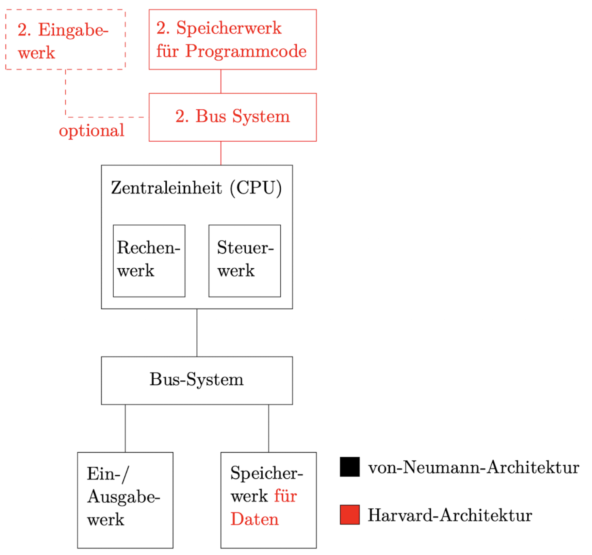
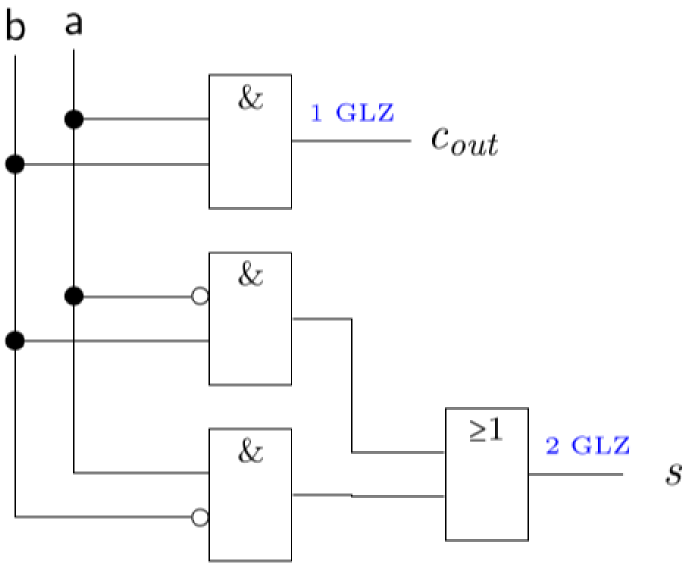
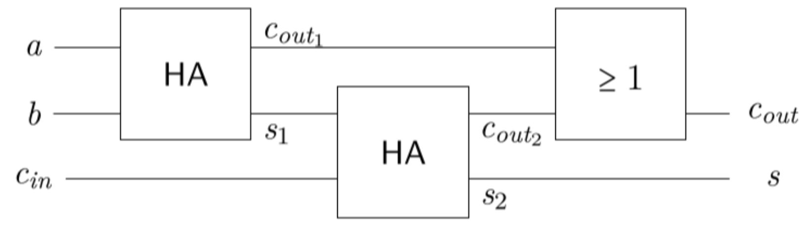
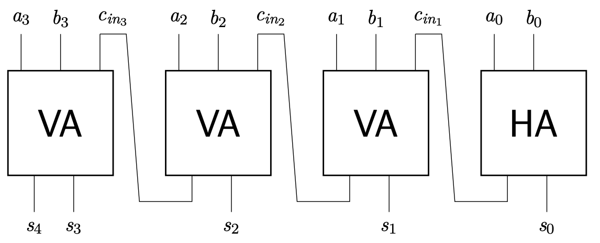
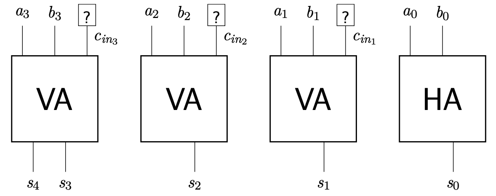
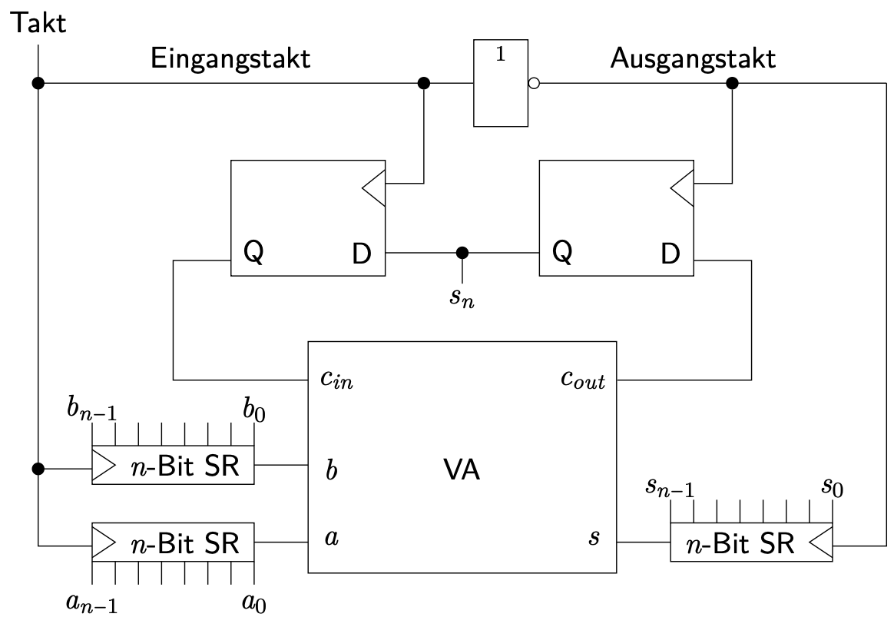
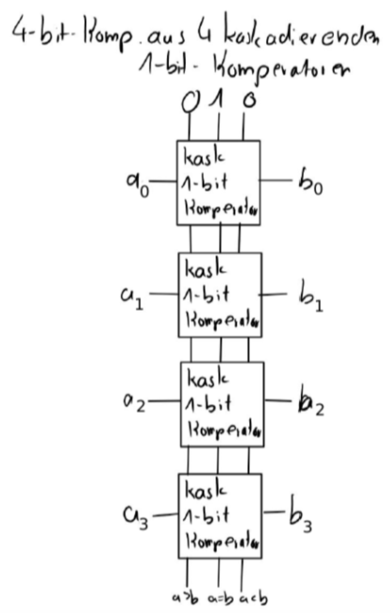

# Aufgabe 1 / Architekturen

---

> (2020, 2020n, 2021, 2022) Fur den Aufbau von Rechnern lassen sich zwei grundsaetzlich unterschiedliche Architekturen verwenden.
> Nennen und skizzieren Sie diese, erlaeutern Sie kurz die einzelnen Komponenten, und gehen Sie inbesondere auf den Unterschied der beiden Architekturen bezuglich
> Aufbau sowie ihre jeweiligen Vor- und Nachteile ein!

**Welche gibt es?**

- Von-Neumann-Architektur (Mehrzahl elektronischer Universalrechner)
- Harvard-Architektur

**Skizze, Komponente und Unterschiede**

- **Rechenwerk**: Durchführen von Rechnungen mit numerischen und logischen Werten
- **Steuerwerk**: Interpretation des Programmcodes und Koordination aller Werke
- **Speicherwerke**: Vorhalten von Nutzdaten und Programmcode gleichermaßen ohne konzeptionelle Trennung der beiden Arten von Informationen
- **Eingabewerk**: "logische Schnittstelle" zu Eingabegerät z.B. USB-Controller
- **Ausgabewerk**: "logische Schnittstelle" für Ausgabegeräte z.B. Graka

**→ Unterschiede Aufbau**: Harvard-Architektur weißt klare Trennung von
Programmcode und Nutzdaten auf, was bei der von-Neumann-Architektur gleich
gehalten wird

**Vor- und Nachteile**

<table>
    <tr>
        <th></th>
        <th>Vorteile</th>
        <th>Nachteile</th>
    </tr>
    <tr>
        <th>Von-Neumann</th>
        <td>
            <ul>
                <li>universelle Programmierbarkeit</li>
                <li>flexible Speicheraufteilung zwischen Programmcode und Daten</li>
                <li>kostengünstig</li>
                <li>einfache Updates von Programm und Betriebssystem</li>
            </ul>
        </td>
        <td>
            <ul>
                <li>Virenanfälligkeit</li>
                <li>Nutzdaten können als Programmcode ausgeführt werden</li>
                <li>möglicher Flaschenhals Bus & Speicherwerk</li>
            </ul>
        </td>
    </tr>
    <tr>
        <th>Harvard</th>
        <td>
            <ul>
                <li>nahezu immun gegen absichtlichen Virenbefall</li>
                <li>keine (unabsichtlichen oder ungewollten) Änderungen an der Betriebssoftware möglich</li>
                <li>bessere Performance möglich durch gleichzeitigen Zugriff auf beide Speicherwerke</li>
            </ul>
        </td>
        <td>
            <ul>
                <li>komplexer und teurer durch mehr Hardware</li>
                <li>schwer update-fähig</li>
                <li>ohne zweites Eingabewerk gibt es keine Möglichkeit anderen Programmcode auszuführen</li>
                <li>unflexible Aufteilung des Speichers</li>
            </ul>
        </td>
    </tr>
</table>

> (2020, 2020n, 2021, 2022) Nennen Sie konkrete Anwendungsfaelle fur den Einsatz dieser beiden Architekturen bei heutigen "Rechnern"

<table>
    <tr>
        <th>von-Neumann</th>
        <th>Harvard</th>
    </tr>
    <tr>
        <td>
            <ul>
                <li>übliche PC-Architektur (universal PC)</li>
            </ul>
        </td>
        <td>
            <ul>
                <li>"embedded systems" (z.B. in Waschmaschinen, KFZ-Elektronik, etc.)</li>
                <li>Smartphones & Co.</li>
                <li>Bestandteile von PCs: BIOS, CPU-Cache in modernen CPUs (Trennung in Cache für Programmcode und Nutzdaten), NX-Flag (Non-Executable) im Hauptspeicher</li>
            </ul>
        </td>
    </tr>
</table>

# Aufgabe 2 / Schaltwerke

## Addierer

> (2015, 2016, 2019, 2020, 2020n, 2021, 2022) Zum Addieren von Zahlen lassen sich Halbaddierer und Volladdierer verwenden.
> Erlaeutern Sie die Unterschiede zwischen einem Halb- und einem Volladdierer und gehen Sie dabei insbesondere auf Anzahl und Bedeutung der jeweiligen Ein- und Ausgaenge ein!

* **Halbaddierer**: Vollzieht die Addition von zwei einstelligen Binärzahlen a und b zu einer zweistelligen Binärzahl `c_out` und `s` (Übertrag und Summe).
    * **Hardwareaufwand**: 8 Transistoren (Anzahl Eingänge)

* **Volladdierer**: Vollzieht die Addition von drei einstelligen Binärzahlen a, b und (Übertrag vorher) zu einer zweistelligen Binärzahl `c_out` und `s` (Übertrag und Summe).
    * **Hardwareaufwand**: 2 * HA + 2 = 18 Transistoren

---

> (2021, 2022) Aus Halb- und/ oder Volladdierern lassen sich mehrstellige Addierer in zwei grundsaetzlich verschiedenen Bauarten zusammenbauen.
> Skizzieren Sie den grundsaetzlichen Aufbau eines 4-bit-Addierers fuer eine der beiden Arten und erlaeutern Sie den Unterschied im Aufbau zwischen den beiden Arten!

**4-Bit-Ripple-Carry-Paralleladdierrer** (RC-PA):

RC-PA ist mehrstelliger Addierer fuer Binaerzahlen. Bei vierstelliger Binaerzahlen (a3, a2, a1, a0 und b3, b2, b1, b0) ist Ergebnis (s4, s3, s2, s1, s0) - `c_in` vom naechsten VA ist `c_out` vom vorherigen VA. 5-Stellige Ausgabe (s4 ist UEberlauf)

**4-Bit-Carry-Look-Ahead-Paralleladdierer** (CLA-PA):

`c_in` Eingang wird nicht von vorausgehenden VA (oder HA) uebernommen, sondern durch "magisches CLA-Schaltnetz" nachberechnet. Fuer Berechnung von `C_in_i` muessen alle vorherigen Eingaenge `a_j`, `b_j`, `j < i` beruecksichtigt wrden. `c_in` wird im Vorraus berechnet -> besserer Zeitaufwand.

**Serielladdierer**:

Summanden werden nacheinander addiert, nur ein Volladdierer und mehrere Schieberegister benötigt. Schaltwerk, kein Schaltnetz.

> (2021, 2022) Die beiden Varianten aus Teilaufgabe b) unterscheiden sich insbesondere in Bezug auf ihren "Aufwand". Was kann Aufwand bedeuten? Erlaeutern Sie diesen Unterschied beim Aufwand der beiden Varianten eines n-bit-Addierers! Geben Sie an (mit Begruendung), wann Sie deshalb welche Variante des Addierers einsetzen wuerden!

**Hardwareaufwand RC-PA**:
* **HA**: 2 Tr. für `c_out` + 6 Tr. für `s` = 8 Transistoren
* **VA**: 2 * HA + 2 Tr. für `c_out` = 18 Transistoren
* **4-Bit RC-PA**: 
  * 1 * _HA_ + (n - 1) * _VA_
  * = 8 Tr. + (n - 1) * 18 Tr. 
  * = 8 Tr. + (18n - 18) Tr. 
  * = 18n - 10 Tr. 
  * => O(n)
HW Aufwand steigt linear mit Breite der Summanden. Gut, weil besseres (weniger Aufwand) ist kaum zu erwarten.

**Zeitaufwand RC-PA**:
* **Aufwand HA**: max. 2 Gatterlaufzeiten (GLZs)
* **Aufwand VA**: max. 4 GLZs
Die einzelnen `s_i` liegen nach unterschiedlicher Zeit an. `s_i` wird nach `(i + 2) * 2` GLZ erreicht. Das laengste `s_i` ist bein n-Bit-RC-PA `i = n - 1` => Zeitaufwand ist `2n` GLZ. Schlecht, zu erwarten waere O(1)! Beim Wechsel von `32-` auf `64-Bit`-CPI haette sich Taktfrequenz halbiert => kein 64-RC-PA in CPU verbaut.

**RC-PA**:
* Hardwareaufwand: 18n - 10
* Zeitaufwand: 2n

**CLA-PA**:
* Hardwareaufwand: n * 4^n
* Zeitaufwand: 4 GLZ

Unterschied kommt dadurch zustande, dass RC-PA hintereinander laeuft, und CLA-PA nebeneinander.
* RC-PA fuer embedded Systems (geringerer HW-Aufwand)
* CLA-PA fuer CPUs (schneller)

---

---

> (2020, 2020n) b. Aus mehreren Halb- und Volladdierern lassen sich Paralleladdierer in zwei verschiedenen Bauarten zusammenbauen. Skizzieren Sie den grundsaetzlichen Aufbau eines 4-bit- Paralleladdierers und erlaeutern Sie den Unterschied im Aufbau zwischen den beiden Varianten!

TODO

> (2020, 2020n) c. Die beiden Varianten aus Teilaufgabe b) unterscheiden sich insbesondere in Bezug auf ihren "Aufwand". Was kann "Aufwand" bedeuten? Erlaeutern Sie diesen Unterschied beim Aufwand der beiden Varianten eines n-bit-Paralleladdierers! Geben Sie an (mit Begrundung), wann Sie deshalb welche Variante des Paralleladdierers einsetzen wurden!

TODO

---

> (2015) Wieviele Halb- oder Volladdierer braucht man für einen 4-Bit Serielladdierer und welche weiteren Komponenten werden benötigt?

TODO

## Multiplizierer

---

> (2016) Mithilfe von einem oder mehreren Paralleladdierern (für mehrstellige Dualzahlen) sowie eventuellen anderen Bauteilen lässt sich ein Multiplizierer aufbauen.

> (2016) Welche Bauteile (Spezifikation und jeweilige Stückzahl) sind notwendig, wenn zwei 4-Bit-Zahlen multipliziert werden sollen?
> Skizzieren Sie den entsprechenden Multiplizierer!

TODO

> (2019) Welche Varianten gibt es? Welche Bauteile (Spezifikation und jeweilige Stueckzahl) sind fuer eine selbstzuwaehlende dieser Varianten notwendig, wenn zwei 4-Bit Zahlen multipliziert werden sollen?
> Skizzieren Sie den entsprechenden Multiplizierer!

TODO

---

## Komparatoren

> (2019) Komparatoren sind Bauelemente, welche beispielsweise in Rechenwerken oder im Cache benoetigt werden. Beschreiben Sie die Funktionalitaet eines Komparators und gehen Sie dabei insbesondere auf den Unterschied bezueglich der beiden genannten Einsatzfaelle Rechenwerk und Cache ein!

TODO

---

> (2019) b. Skizzieren Sie die Realisierung eines 4-stelligen Komparators fuer den Einsatz in einem Rechenwerk als Schaltnetz oder Schaltwerk!

> (2019) c. Beschreiben Sie den Aufwand des Komparators aus Teilaufgabe b) in Abhaengigkeit der Stellenanzahl!

---

# Aufgabe 3 / Cache

> (2015, 2016, 2020, 2020n, 2021, 2022) Was ist ein Cache? Welche Eigenschaften hat ein Cache? Und welche Eigenschaften sollte dieser zusätzlich noch haben? Erlaeutern Sie die Eigenschaften kurz!

Temporärer, flüchtiger, schneller Zwischenspeicher, um auf Informationen aus dem Hauptspeicher schneller zugreifen zu können.

**Eigenschaften des Cache**:
* flüchtig —> verlieren Inhalt, sobald Strom abgeschaltet wird
* kleiner als das zu cachende Medium (Hauptspeicher)
* schneller als das zu cachende Medium (Hauptspeicher)
* transparent —> es wird nicht auf den Cache, sondern auf das zu cachende Medium logisch zugegriffen (die CPU adressiert den Hauptspeicher und nicht den Cache)
* konsistent —> alle Instanzen derselben Hauptspeicheradresse (HSA) haben denselben Wert
* kohärent —> beim Zugriff auf eine HSA wird immer der aktuelle Wert geliefert

> (2016) Ein Cache kann entsprechend der Look-Aside- sowie der Look-Through-Architektur aufgebaut sein und mit der Write-Back- sowie der Write-Through-Strategie arbeiten.
> Erläutern Sie die vier Begriffe "Look-Aside-Architektur", "Look-Through-Architektur", "Write-Back-Strategie", "Write-Through-Strategie" sowie deren jeweilige Vor- und Nachteile!

TODO

> (2016) Welche der Cache-Architekturen und Schreibstrategien lassen sich gut und welche weniger gut kombinieren? Begründen Sie Ihre Antwort!

TODO

> (2016, 2019) Ihr System besitzt einen Hauptspeicher mit 256 Speicherworten (linear adressiert beginnen mit der Adresse 0; eine Hauptspeicherseite umfasst 4 Worte) und benutzt einen Zwei-Wege-Assoziativ-Cache mit zwei mal acht Cachelines (4 Worte je Cacheline). Nacheinander wird auf die Hauptspeicheradressen (dezimal) 13, 42, 8, 15 und 73 zugegriffen.
>
> Erläutern Sie den Verlauf der Zugriffe und insbesondere, ob es sich bei dem jeweiligen Zugriff um einen Hit oder einen Miss handelt! Skizzieren Sie im folgenden Diagramm die Cachebelegung, nachdem diese Zugriffe stattgefunden haben und machen Sie deutlich, wo konkret die zugegriffenen Worte mit diesen Hauptspeicheradressen im Cache liegen!
>
> 

TODO

---

> (2015, 2016, 2019, 2020, 2021) Was versteht man bei einem Cache unter Verdrängung?
> Wann und warum muss Verdrängung stattfinden?

Wenn eine HSS (Hauptspeicherseite) in den Cache geladen wird, muss eine andere HSS aus dem Cache verdrängt werden, wenn der Cache voll ist. Eine Kollision ist voraussetzung für eine Verdrängung. Mit einer Verdrängungsstrategie wird entschieden, welche HSS verdrängt wird.

> (2016, 2019) Wo spielt Verdrängung bei obigem Zugriffsverlauf ("Hauptspeicher mit 256, ...") eine Rolle?

TODO

> (2015m, 2016m, 2019m, 2020m, 2021) Erläutern Sie die Verdraengungsstrategien "zufaellig", "FIFO", "optimal", "LRU" und "LFU" deren Unterschied und geben Sie den Aufwand an!
> Zu welchem Zweck werden diese Strategien tatsaechlich eingesetzt?

TODO

---

> (2015) Welches sind die beiden Speichertypen für RAM Speicher? Welche FlipFlops / Speichermethoden werden verwendet? Beschreiben Sie jeweils die Funktionsweise!

TODO

---

> (2015, 2020, 2020n, 2021, 2022) Der Speicher ist logisch linear aber physikalisch als Matrix organisiert. Was bedeutet das? (Was sind die Vorteile? | Nennen Sie die Gruende fuer diese Matrix-Organisation!)

**Eine matrixförmige Speicherorganisation**: zweidimensionale Anordnung der Speicherwerte in Zeilen und Spalten.

**Gründe**:
* weniger Aufwand für Adressdecodierung 
* Einlesen einer ganzen Hauptspeicherseite (HSS) (=Matrixzeile) in den Cache
* zeilenweiser Refresh des HS (wortweiser Refresh-Zyklus dauert viel zu lange)

> (2020, 2020n, 2021, 2022) Decoder und Multiplexer sind zwei wichtige und im Aufbau sehr aehnliche Bauteile zur Realisierung der Matrix-Organisation. Beschreiben Sie die Funktionalitaet der beiden Bauteile Decoder und Multiplexer, und zeichnen Sie das Schaltbild eines 4:1- Multiplexers, welchen Sie mit Hilfe des entsprechenden Decoders realisieren koennen! Warum wird bei der Matrix-Organisation einer der beiden Decoder durch einen Multiplexer ersetzt?

TODO

---

> (2015) Neben dem RAM Speicher gibt es auch ROM Speicher. Beschreiben Sie die einzelnen Arten usw.

TODO

---

> (2015, 2020, 2020n, 2021) Erläutern Sie den Unterschied zwischen den drei Arten (Direct Mapped, Vollassoziativ, N-Weg Assoziativ).
> Inwiefern hat die Unterscheidung der drei Arten mit den in der Aufgabe oben drüber genannten Prinzip der Verdrängung zu tun (zufaellig, optimal, LRU und LFU, ...)

TODO

---
