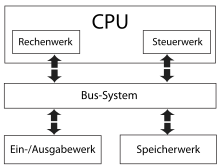

# Aufgabe 1 / Architekturen

---

> (2020, 2020n, 2021, 2022) Fur den Aufbau von Rechnern lassen sich zwei grundsaetzlich unterschiedliche Architekturen verwenden. 
> Nennen und skizzieren Sie diese, erlaeutern Sie kurz die einzelnen Komponenten, und gehen Sie inbesondere auf den Unterschied der beiden Architekturen bezuglich 
> Aufbau sowie ihre jeweiligen Vor- und Nachteile ein!

TODO

> (2020, 2020n, 2021, 2022) Nennen Sie konkrete Anwendungsfaelle fur den Einsatz dieser beiden Architekturen bei heutigen "Rechnern"

TODO

---

## Von-Neumann-Architektur

> (2015, 2016, 2019) Welche ist die heutzutage üblichste Rechnerarchitektur? Skizzieren Sie diese kurz und 
erläutern Sie die Aufgaben der einzelnen Bestandteile kurz!

Von-Neumann-Architektur

- Zentraleinheit besteht aus:
    * Rechenwerk: Führt arithmetische und boolsche Rechneroperationen durch
    * Steuerwerk: Liest Programmcode, stellt Daten bereit und koordiniert alle Werke
- Eingabewerk: Schnittstelle zur Eingabe-Peripheriegeräten
- Ausgabewerk: Schnittstelle zur Ausgabe-Peripheriegeräten
- Speicherwerk: Speicher für Programmcode und Daten ohne Unterscheidung

## Harvard-Architektur

> (2015, 2016, 2019) Neben der Von-Neumann-Architektur existiert eine andere Architektur: Die Harvard Architektur.
> Erlaeutern Sie diese und gehen Sie insbesondere auf die Unterschiede, Vor- und Nachteile der beiden Architekturen ein! Nennen Sie zwei konkrete und grundsaetzlich unterschiedliche Beispiele, wo ein Rechner oder Bestandteile von Rechnern eher der Harvard-Architektur entsprechen!

TODO

---

# Aufgabe 2 / Schaltwerke

## Halbaddierer und Volladdierer

> (2015, 2016, 2019, 2020, 2020n, 2021, 2022) Zum Addieren von Zahlen lassen sich Halbaddierer und Volladdierer verwenden.
> Erlaeutern Sie die Unterschiede zwischen einem Halb- und einem Volladdierer und gehen Sie dabei insbesondere auf Anzahl und Bedeutung der jeweiligen Ein- und Ausgaenge ein!

TODO

---

> (2021, 2022) Aus Halb- und/ oder Volladdierern lassen sich mehrstellige Addierer in zwei grundsaetzlich verschiedenen Bauarten zusammenbauen. 
> Skizzieren Sie den grundsaetzlichen Aufbau eines 4-bit-Addierers fuer eine der beiden Arten und erlaeutern Sie den Unterschied im Aufbau zwischen den beiden Arten!

TODO

> (2021, 2022)  Die beiden Varianten aus Teilaufgabe b) unterscheiden sich insbesondere in Bezug auf ihren "Aufwand". Was kann Aufwand bedeuten? Erlaeutern Sie diesen Unterschied beim Aufwand der beiden Varianten eines n-bit-Addierers! Geben Sie an (mit Begruendung), wann Sie deshalb welche Variante des Addierers einsetzen wuerden!

---

---

> (2016) Mithilfe von einem oder mehreren Paralleladdierern (für mehrstellige Dualzahlen) sowie eventuellen anderen Bauteilen lässt sich ein Multiplizierer aufbauen.

> (2016) Welche Bauteile (Spezifikation und jeweilige Stückzahl) sind notwendig, wenn zwei 4-Bit-Zahlen multipliziert werden sollen?
> Skizzieren Sie den entsprechenden Multiplizierer!

TODO

> (2019) Welche Varianten gibt es? Welche Bauteile (Spezifikation und jeweilige Stueckzahl) sind fuer eine selbstzuwaehlende dieser Varianten notwendig, wenn zwei 4-Bit Zahlen multipliziert werden sollen? 
> Skizzieren Sie den entsprechenden Multiplizierer!

TODO

---

---

> (2020, 2020n) b. Aus mehreren Halb- und Volladdierern lassen sich Paralleladdierer in zwei verschiedenen Bauarten zusammenbauen. Skizzieren Sie den grundsaetzlichen Aufbau eines 4-bit- Paralleladdierers und erlaeutern Sie den Unterschied im Aufbau zwischen den beiden Varianten!

TODO

> (2020, 2020n) c. Die beiden Varianten aus Teilaufgabe b) unterscheiden sich insbesondere in Bezug auf ihren "Aufwand". Was kann "Aufwand" bedeuten? Erlaeutern Sie diesen Unterschied beim Aufwand der beiden Varianten eines n-bit-Paralleladdierers! Geben Sie an (mit Begrundung), wann Sie deshalb welche Variante des Paralleladdierers einsetzen wurden! 

TODO

---

> (2019) Komparatoren sind Bauelemente, welche beispielsweise in Rechenwerken oder im Cache benoetigt werden. Beschreiben Sie die Funktionalitaet eines Komparators und gehen Sie dabei insbesondere auf den Unterschied bezueglich der beiden genannten Einsatzfaelle Rechenwerk und Cache ein!

TODO

---

> (2019) b. Skizzieren Sie die Realisierung eines 4-stelligen Komparators fuer den Einsatz in einem Rechenwerk als Schaltnetz oder Schaltwerk!

TODO

> (2019) c. Beschreiben Sie den Aufwand des Komparators aus Teilaufgabe b) in Abhaengigkeit der Stellenanzahl!

---

> (2015) Skizzieren Sie einen 4-Bit-PA

TODO

> (2015) Skizzieren Sie einen 4-Bit-SA

TODO

> (2015) Bauen Sie aus mehreren Halb- und Vollbitaddierern einen 4-Bit Paralleladdierer. Machen Sie dazu eine Skizze. Wie viele Halb- und Volladdierer benötigt man dafür?

TODO

> (2015) Wieviele Halb- oder Volladdierer braucht man für einen 4-Bit Serielladdierer und welche weiteren Komponenten werden benötigt?

TODO

# Aufgabe 3 / Cache

> (2015, 2016, 2020, 2020n, 2021, 2022) Was ist ein Cache? Welche Eigenschaften hat ein Cache? Und welche Eigenschaften sollte dieser zusätzlich noch haben? Erlaeutern Sie die Eigenschaften kurz!

TODO

> (2016) Ein Cache kann entsprechend der Look-Aside- sowie der Look-Through-Architektur aufgebaut sein und mit der Write-Back- sowie der Write-Through-Strategie arbeiten. 
> Erläutern Sie die vier Begriffe "Look-Aside-Architektur", "Look-Through-Architektur", "Write-Back-Strategie", "Write-Through-Strategie" sowie deren jeweilige Vor- und Nachteile!

TODO

> (2016) Welche der Cache-Architekturen und Schreibstrategien lassen sich gut und welche weniger gut kombinieren? Begründen Sie Ihre Antwort!

TODO

> (2016, 2019) Ihr System besitzt einen Hauptspeicher mit 256 Speicherworten (linear adressiert beginnen mit der Adresse 0; eine Hauptspeicherseite umfasst 4 Worte) und benutzt einen Zwei-Wege-Assoziativ-Cache mit zwei mal acht Cachelines (4 Worte je Cacheline). Nacheinander wird auf die Hauptspeicheradressen (dezimal) 13, 42, 8, 15 und 73 zugegriffen.
>
> Erläutern Sie den Verlauf der Zugriffe und insbesondere, ob es sich bei dem jeweiligen Zugriff um einen Hit oder einen Miss handelt! Skizzieren Sie im folgenden Diagramm die Cachebelegung, nachdem diese Zugriffe stattgefunden haben und machen Sie deutlich, wo konkret die zugegriffenen Worte mit diesen Hauptspeicheradressen im Cache liegen!
>
> 

TODO

---

> (2015, 2016, 2019, 2020, 2021) Was versteht man bei einem Cache unter Verdrängung? 
> Wann und warum muss Verdrängung stattfinden?

TODO

> (2016, 2019) Wo spielt Verdrängung bei obigem Zugriffsverlauf ("Hauptspeicher mit 256, ...") eine Rolle?

TODO

> (2015m, 2016m, 2019m, 2020m, 2021) Erläutern Sie die Verdraengungsstrategien "zufaellig", "FIFO", "optimal", "LRU" und "LFU" deren Unterschied und geben Sie den Aufwand an!
> Zu welchem Zweck werden diese Strategien tatsaechlich eingesetzt?

TODO

---

> (2015) Welches sind die beiden Speichertypen für RAM Speicher? Welche FlipFlops / Speichermethoden werden verwendet? Beschreiben Sie jeweils die Funktionsweise!

TODO

---

> (2015, 2020, 2020n, 2021, 2022) Der Speicher ist logisch linear aber physikalisch als Matrix organisiert. Was bedeutet das? (Was sind die Vorteile? | Nennen Sie die Gruende fuer diese Matrix-Organisation!)

TODO

> (2020, 2020n, 2021, 2022) Decoder und Multiplexer sind zwei wichtige und im Aufbau sehr aehnliche Bauteile zur Realisierung der Matrix-Organisation. Beschreiben Sie die Funktionalitaet der beiden Bauteile Decoder und Multiplexer, und zeichnen Sie das Schaltbild eines 4:1- Multiplexers, welchen Sie mit Hilfe des entsprechenden Decoders realisieren koennen! Warum wird bei der Matrix-Organisation einer der beiden Decoder durch einen Multiplexer ersetzt?

TODO

---

> (2015) Neben dem RAM Speicher gibt es auch ROM Speicher. Beschreiben Sie die einzelnen Arten usw.

TODO

---

> (2015, 2020, 2020n, 2021) Erläutern Sie den Unterschied zwischen den drei Arten (Direct Mapped, Vollassoziativ, N-Weg Assoziativ). 
> Inwiefern hat die Unterscheidung der drei Arten mit den in der Aufgabe oben drüber genannten Prinzip der Verdrängung zu tun (zufaellig, optimal, LRU und LFU, ...)

TODO

---

