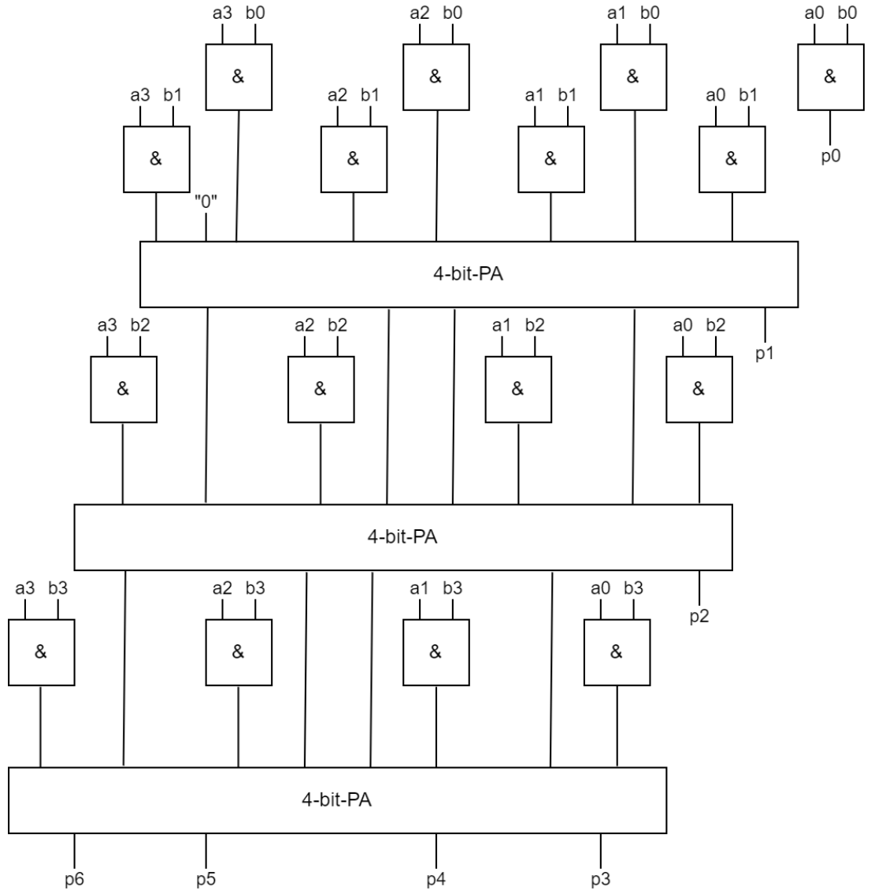
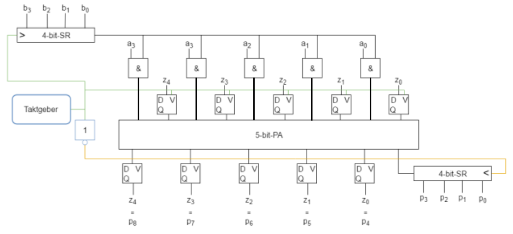
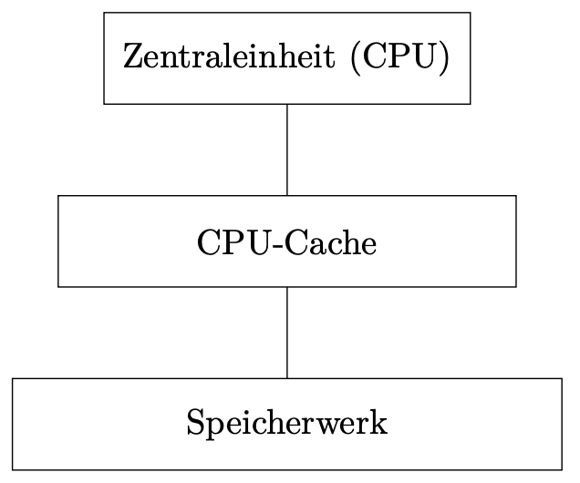
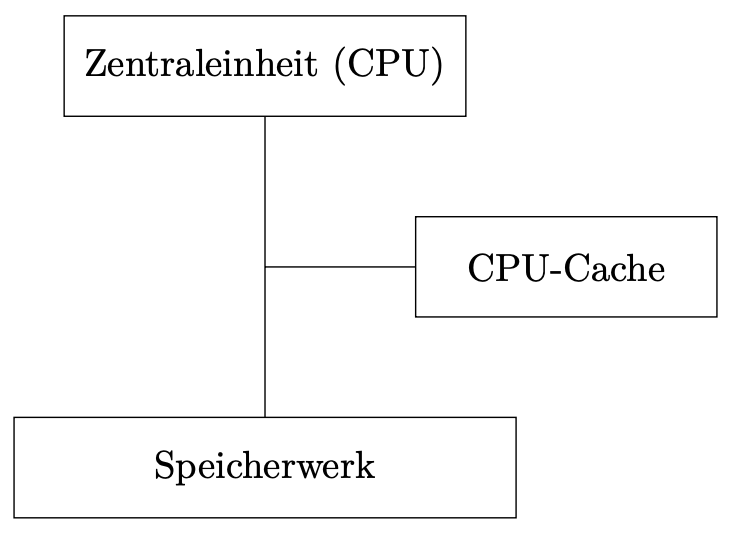

## Architekturen

- Von-Neumann-Architektur (Mehrzahl elektronischer Universalrechner)
- Harvard-Architektur

**Skizze, Komponente und Unterschiede**

- **Rechenwerk**: Durchführen von Rechnungen mit numerischen und logischen Werten
- **Steuerwerk**: Interpretation des Programmcodes und Koordination aller Werke
- **Speicherwerke**: Speichern von Informationen (sowohl Programmcode als auch Nutzdaten)
- **Eingabewerk**: "logische Schnittstelle" zu Eingabegerät z.B. USB-Controller
- **Ausgabewerk**: "logische Schnittstelle" für Ausgabegeräte z.B. Graka
- **Bus-System**: Verbindet alle Komponenten und ermöglicht Datenaustausch

**→ Unterschiede Aufbau**: Harvard-Architektur weißt klare Trennung von
Programmcode und Nutzdaten auf, was bei der von-Neumann-Architektur gleich
gehalten wird

**Vor- und Nachteile**

<table>
    <tr>
        <th></th>
        <th>Vorteile</th>
        <th>Nachteile</th>
    </tr>
    <tr>
        <th>Von-Neumann</th>
        <td>
            <ul>
                <li>universelle Programmierbarkeit</li>
                <li>flexible Speicheraufteilung zwischen Programmcode und Daten</li>
                <li>kostengünstig</li>
                <li>einfache Updates von Programm und Betriebssystem</li>
            </ul>
        </td>
        <td>
            <ul>
                <li>Virenanfälligkeit</li>
                <li>Nutzdaten können als Programmcode ausgeführt werden</li>
                <li>möglicher Flaschenhals Bus & Speicherwerk</li>
            </ul>
        </td>
    </tr>
    <tr>
        <th>Harvard</th>
        <td>
            <ul>
                <li>nahezu immun gegen unabsichtlichen Virenbefall</li>
                <li>keine (unabsichtlichen oder ungewollten) Änderungen an der Betriebssoftware möglich</li>
                <li>bessere Performance möglich durch gleichzeitigen Zugriff auf beide Speicherwerke</li>
            </ul>
        </td>
        <td>
            <ul>
                <li>komplexer und teurer durch mehr Hardware</li>
                <li>schwer update-fähig</li>
                <li>ohne zweites Eingabewerk gibt es keine Möglichkeit anderen Programmcode auszuführen</li>
                <li>unflexible Aufteilung des Speichers</li>
            </ul>
        </td>
    </tr>
</table>

<table>
    <tr>
        <th>von-Neumann</th>
        <th>Harvard</th>
    </tr>
    <tr>
        <td>
            <ul>
                <li>übliche PC-Architektur (universal PC)</li>
            </ul>
        </td>
        <td>
            <ul>
                <li>"embedded systems" (z.B. in Waschmaschinen, KFZ-Elektronik, etc.)</li>
                <li>Smartphones & Co.</li>
                <li>Bestandteile von PCs: BIOS, CPU-Cache in modernen CPUs (Trennung in Cache für Programmcode und Nutzdaten), NX-Flag (Non-Executable) im Hauptspeicher</li>
            </ul>
        </td>
    </tr>
</table>

## Addierer

- **Halbaddierer**: Vollzieht die Addition von zwei einstelligen Binärzahlen a und b zu einer zweistelligen Binärzahl `c_out` und `s` (Übertrag und Summe).
  - **Hardwareaufwand**: 8 Transistoren (Anzahl Eingänge)

- **Volladdierer**: Vollzieht die Addition von drei einstelligen Binärzahlen a, b und (Übertrag vorher) zu einer zweistelligen Binärzahl `c_out` und `s` (Übertrag und Summe).
  - **Hardwareaufwand**: 2 \* HA + 2 = 18 Transistoren

### Aufwand

**RC-PA**:

- Hardwareaufwand: 18n - 10
- Zeitaufwand: 2n GLZ

**CLA-PA**:

- Hardwareaufwand: n \* 4^n
- Zeitaufwand: 4 GLZ

- Unterschied kommt dadurch zustande, dass RC-PA hintereinander laeuft, und CLA-PA nebeneinander.
- **RC-PA fuer embedded Systems (geringerer HW-Aufwand)**
- **CLA-PA fuer CPUs (schneller)**

### Mehrstellige Addierer

Grundsätzlicher Unterschied: Parallel und Seriell. Bei Seriell werden Zahlen taktweise nacheinander addiert, bei parallel taktweise nebeneinander.

**4-Bit-Ripple-Carry-Paralleladdierrer** (RC-PA):

RC-PA ist mehrstelliger Addierer fuer Binaerzahlen. Bei vierstelliger Binaerzahlen (a3, a2, a1, a0 und b3, b2, b1, b0) ist Ergebnis (s4, s3, s2, s1, s0) - `c_in` vom naechsten VA ist `c_out` vom vorherigen VA. 5-Stellige Ausgabe (s4 ist UEberlauf)

**Serielladdierer**:

- Braucht nur einen VA.

## Multiplizierer

**Multiplikation mit Paralleladdierer**:

- 16 UND-Gatter und 3 4-Bit Paralleladdierer

**Multiplikation mit Seriellmultiplizierer**:

- Motivation: Engere Anlehnung an schriftliche Multiplikationsverfahren
- Einsatz grundsätzlich sinnvoll, wenn HW-Aufwand eingespart werden soll
  - Weitere HW-Einsparung möglich, falls Faktor seriell ankommt oder Ergebnis seriell ausgegeben werden soll
- 5 UND-Gatter, 2 Schieberegister, 1 Taktgeber, 10 D-FF

## Komparator

Ein Komparator vergleicht zwei binäre Zahlen von links nach rechts.
Für das Rechenwerk ist es wichtig, welche der Zahlen größer ist (bzw. ob die Zahlen gleich sind) und der Cache muss nur wissen, ob die Zahlen gleich sind (Adresse eines gesuchten Datenblocks mit den im Cache gespeicherten Adressen zu vergleichen).

**HW-Aufwand eines kaskadierbaren 1-Bit-Komparator** (4 stellig):

- HW: 18 Tr. -> (Allgemein: 18\*n Tr.)
- Zeit: 2 GLZ -> (Allgemein: 2\*n GLZ)
- Linearer Zeitaufwand

**4-stelliger Komparator**:

## Cache

Temporärer, flüchtiger, schneller Zwischenspeicher, um auf Informationen aus dem Hauptspeicher schneller zugreifen zu können.

**Eigenschaften des Cache**:

- flüchtig —> verlieren Inhalt, sobald Strom abgeschaltet wird
- kleiner als das zu cachende Medium (Hauptspeicher)
- schneller als das zu cachende Medium (Hauptspeicher)
- transparent —> es wird nicht auf den Cache, sondern auf das zu cachende Medium logisch zugegriffen (die CPU adressiert den Hauptspeicher und nicht den Cache)
- konsistent —> alle Instanzen derselben Hauptspeicheradresse (HSA) haben denselben Wert
- kohärent —> beim Zugriff auf eine HSA wird immer der aktuelle Wert geliefert

> (2016) Ein Cache kann entsprechend der Look-Aside- sowie der Look-Through-Architektur aufgebaut sein und mit der Write-Back- sowie der Write-Through-Strategie arbeiten.
> Erläutern Sie die vier Begriffe "Look-Aside-Architektur", "Look-Through-Architektur", "Write-Back-Strategie", "Write-Through-Strategie" sowie deren jeweilige Vor- und Nachteile!

**Look-Through**:

CPU nur mit Cache verbunden. CPU greift über Cache auf Hauptspeicher zu.

| Vorteil             | Nachteil                                    |
| ------------------- | ------------------------------------------- |
| optimale Konsistenz | Zugriffszeit bei Miss größer als ohne Cache |

**Look-Aside**:

CPU, Cache und HS über einen Bus verbunden. Anfrage durch CPU geht per Bus an beide und ggf. antworten beide, d. h. die schnellere Antwort gewinnt.

| Vorteil                                                                         | Nachteil                                                                  |
| ------------------------------------------------------------------------------- | ------------------------------------------------------------------------- |
| Zugriffszeit bei einem Miss genauso wie ohne Cache (immer "beste" Zugriffszeit) | Bus braucht Zugriffsprotokoll mit Overhead (langsamer als 1:1 Verbindung) |
|                                                                                 | Konsistenz durch zweite Antwort potentiell gefährdet                      |

**Write-Back**:

Schreibzugriff durch CPU findet im Cache statt und Cache aktualisiert Daten bei nächster Gelegenheit im Hauptspeicher.

| Vorteil                                    | Nachteil                           |
| ------------------------------------------ | ---------------------------------- |
| Schreiben in Cache-Geschwindigkeit möglich | zeitwertige Inkonsistenz der Daten |

**Write-Through**:

Schreibzugriff durch CPU findet im Hauptspeicher statt. Parallel dazu müssen Daten im Cache invalidiert (schlecht) oder geschrieben werden (gut).

| Vorteil                       | Nachteil                                    |
| ----------------------------- | ------------------------------------------- |
| Optimale Konsistenz der Daten | Schreiben nur in HS-Geschwindigkeit möglich |

### Verdrängung

Wenn eine HSS (Hauptspeicherseite) in den Cache geladen wird, muss eine andere HSS aus dem Cache verdrängt werden, wenn der Cache voll ist.
Eine Kollision ist voraussetzung für eine Verdrängung. Mit einer Verdrängungsstrategie wird entschieden, welche HSS verdrängt wird.

**Zufällig**:

Eine zufällige HSS wird verdrängt.

- **Aufwand**: Zufallszahlengenerator
  - echter Zufall ist sehr teuer & aufwändig
  - für Benchmarks reichen (meist) Pseudozufallszahlen aus
- **Zweck**: (in Praxis selten verwendet) Benchmarking

**FIFO** (First In First Out):

Die HSS, welche am längsten im Cache ist, wird verdrängt.

- **Aufwand**: Timestamp bei jeder Cache Line. Bei Verdrängung muss die Cache Line mit dem ältesten Timestamp gesucht werden. (sehr aufwändig!)
- **Zweck**: Einfach zu implementieren, aber aktualität der Daten nicht berücksichtigt, daher nicht die beste Wahl

**Optimale Strategie**:

Es wird die HSS verdrängt, welche in der Zukunft gar nicht mehr oder am längsten nicht mehr benötigt wird.

- **Aufwand**: "Blick in die Zukunft" bzw. "Kristallkugel" => ist nicht möglich.
- **Zweck**: Realisierung für Benchmarking

**LRU** (Least Recently Used):

Die HSS, auf welche am längsten nicht mehr zugegriffen wurde, wird verdrängt.

- **Aufwand**: Timestamp mit Update bei jedem Zugriff => Suche bei Verdrängung ist zu aufwändig!
- **Zweck**: Relativ effektiv, aber Implementierung kann komplex sein

**LFU** (Least Frequently Used):

Die HSS, auf welche am wenigsten seltensten ("am wenigsten häufig") wurde, wird verdrängt.

- **Aufwand**: Benutzungszähler, Einlagerungszähler
- **Häufigkeit** = Zugriffe / Zeit => Bei Verdrängung aufwändige Berechnung und Suche
- **Zweck**: Falls häufig verwendete Blöcke im HS gehalten werden sollen

## Decoder/Multplexer

Ein **Decoder** ist ein Bauteil für Schaltungen, welches über die Eingänge einen binärcodierten Ausgang aktiviert.
Ein Decoder mit n Eingängen kann maximal 2^n Ausgänge ansteuern.
Der Decoder wählt eine der Ausgangsleitungen basierend auf dem Binärwert an den Eingangsleitungen aus.
Alle anderen Ausgangsleitungen sind deaktiviert

Ein **Multiplexer** (Mux) ist ein Bauteil für Schaltungen, welches über 2^n Dateneingänge, n Steuereingänge und genau 1 Ausgang verfügt.
Dabei wird der jeweilige Wert des Eingangs an den Ausgang weitergeleitet, welcher gerade durch den binärcodierten Wert über Steuereingänge aktiv geschaltet ist.

- Wird zum Einsparen von Transistoren an den Speicherzellen eingesetzt.

### Voll-assoziativer Cache

Jede HSS kann potentiell in jede CL eingelagert werden

> Ein Komperator für jede CL
> Kollision erst wenn der Cache voll ist

Wie kann verglichen werden? Welche Möglichkeiten des Vergleichs gibt es?

- Sequentiell: —> Nachteil: erhöhte Zugriffszeit
- Parallel: —> gleichzeitiges Vergleichen der angelegten (gekürzten) HSA mit allen Tags über jeweils einen eigenen Komperator in jeder CL

### Direct-Mapped Cache

Beim Direct-Mapped-Cache (DMC) gibt es für jede HSS genau eine CL, in welche diese HSS eingelagert werden kann.

—> Ein Komperator reicht für den gesamten Cache Kollision ab zweiten Zugriff möglich

### n-Wege-Assoziativ-Cache

Für jede HSS gibt es genau n Cache Lines, in welche die HSS eingelagert werden kann. Die
Realisierung findet über n DMC statt, welche alle jeweils gleich aufgebaut sind. —> Es gibt n Komperatoren

-> Kollision ab n +1 Zugriff möglich
